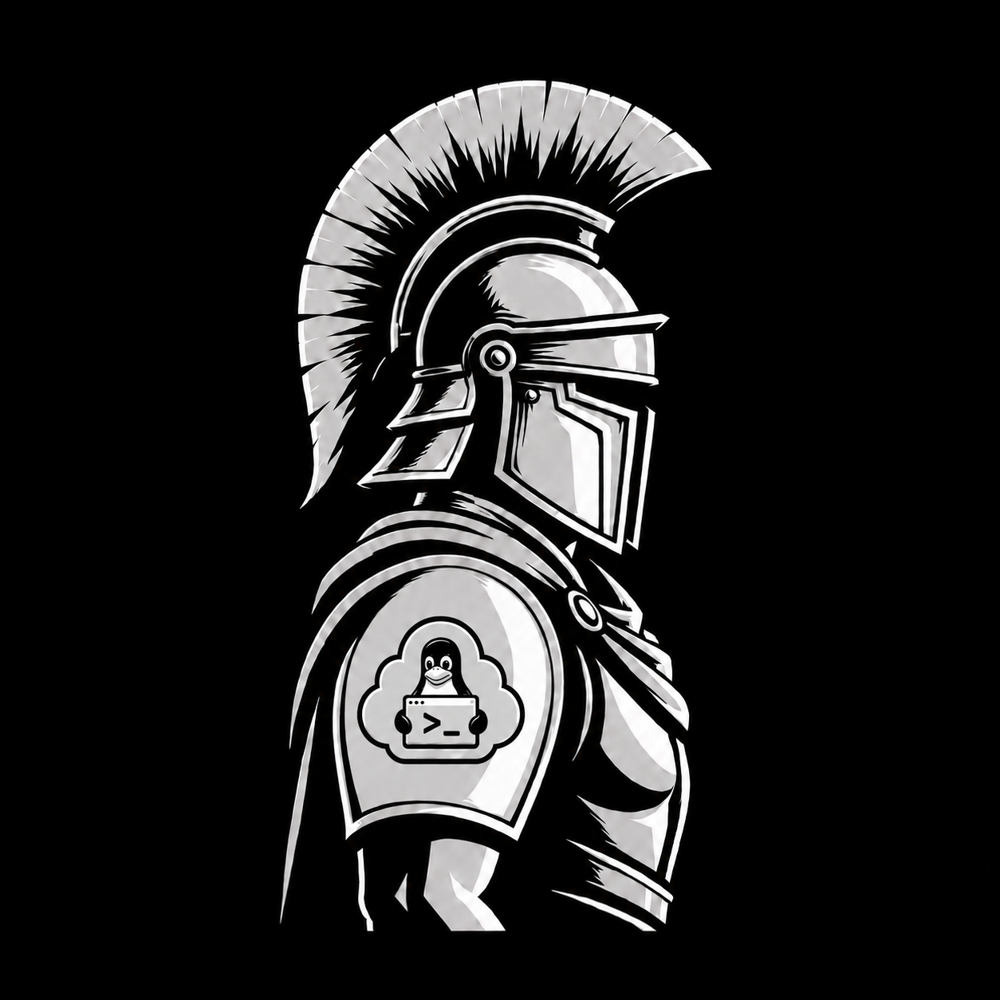
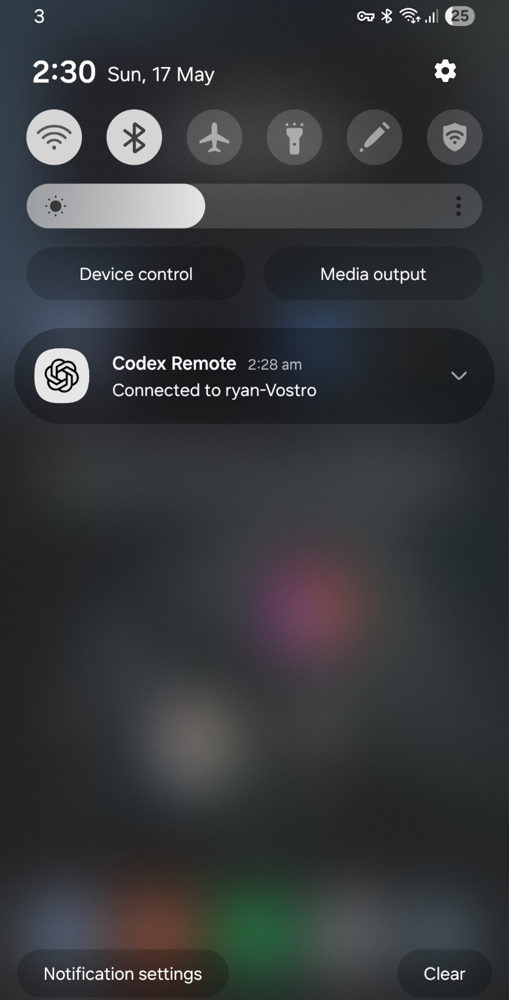
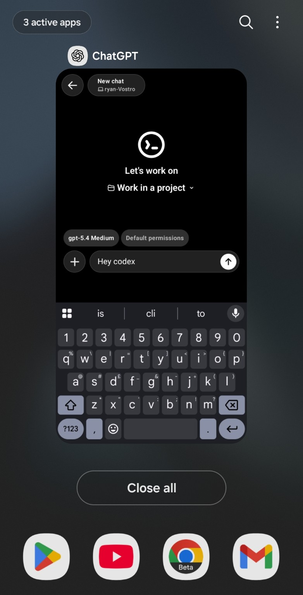
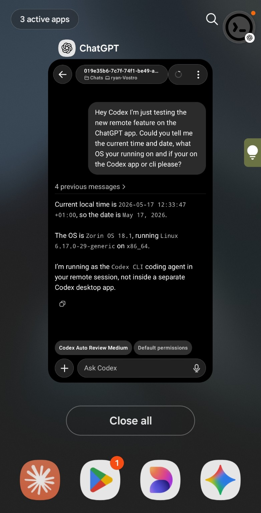

<div align="center">
  
</div>

# Legion: Rosetta Codex

*Salve, Mundus. Adsum. Initium est.*

The bridge between remote access through the Android ChatGPT app and your Linux Codex CLI runtime.

This project leverages the remote access functionality OpenAI built into the mobile ChatGPT app, which currently connects to the Codex macOS app.

Using that capability, I have added a bridge from the ChatGPT app directly into the Linux Codex CLI instead. The same shape should be adaptable elsewhere, including iOS, Windows, and other runtimes.

This is the first project I have ever created with the aid of Codex, GPT, and Claude.

Feedback is greatly appreciated. Hope you enjoy!

**Legion: Wottto**

---

## Proof it works

Android notification confirming the remote connection to `ryan-Vostro`:

<div align="center">
  
</div>

The ChatGPT app on Android, connected to the Linux Codex CLI runtime:

<div align="center">
  
</div>

Codex confirming it is running as the CLI agent, not the desktop app:

<div align="center">
  
</div>

---

## Status

This project is usable now for:

- Linux host inspection
- app-server probing
- remote-control enrollment inspection
- localhost remote-control emulation

The one material gap still under investigation is shared-history parity:

- Android remote sessions can create and resume threads in the same Linux `.codex` pool
- remote prompt persistence is not yet as clean or visible as normal CLI turns

## What problem this addresses

Codex remote access on mobile is useful, but Linux users run into an awkward gap:

- the remote-control host exists
- the protocol exists
- the Android client can attach
- but the host behavior is opaque
- and Linux-side session behavior is hard to inspect or reason about

This project exists to make that Linux host boundary visible and workable.

It does **not** rebuild the Codex desktop app.
It does **not** spoof a fake full client.
It focuses on the Linux host side: launch, inspect, emulate, and verify.

## What was wrong

The main problems we hit were:

- `codex remote-control` is not a simple local websocket listener
- the official remote path uses an enrolled outbound websocket client
- Android remote activity is not naturally obvious from the normal Linux CLI view
- thread/session behavior is easy to confuse because the remote client can `thread/start` or `thread/resume` inside the same local `.codex` pool
- proving what the remote client is doing requires better tooling than "look at stdout"

In short: the pieces worked, but the Linux-side behavior was too black-box to use confidently.

## What this project does

`Legion: Rosetta Codex` adds a practical Linux toolset around that host path:

- launch Codex host modes through a neutral runtime host
- inspect persisted remote-control enrollment state
- run a localhost remote-control emulator for protocol capture and replay
- connect directly to `codex app-server` for protocol exploration
- compare plain app-server behavior against the real remote-control path

## What has been fixed or proven

This project has already proven the important boundaries:

- `codex app-server` can be launched and driven from Linux over websocket
- `codex remote-control` is an enrolled outbound client, not just a local listener
- the localhost emulator can receive real remote-control enrollment and websocket traffic
- the Android remote client can touch the shared Linux `.codex` state pool
- the remote client can `thread/start` and `thread/resume` against Linux-hosted Codex state

That means the host-side transport and session plumbing are real.

## Current known issue

The main remaining bug is not "can Android reach Linux?"

It is this:

- the Android remote client can create or resume shared Linux threads
- but remote prompt content is not yet landing in the shared local history as cleanly as normal CLI turns

Plainly:

- shared Linux session pool: yes
- shared resume list: yes
- remote message persistence matching normal CLI history: still inconsistent

That is the next layer to solve.

## How it works

There are three useful lanes here:

1. `runtime_host.py`

- neutral launcher/controller
- starts Codex host modes
- tracks active state and logs
- renders launch plans from a manifest plus runtime

2. `codex_remote_control_inspect.py`

- reads the local persisted enrollment from `~/.codex/state_5.sqlite`
- confirms whether the host is enrolled on the real `chatgpt.com` remote-control path

3. `codex_remote_control_emulator.mjs`

- acts as a localhost fake backend for enroll plus websocket flow
- lets you capture and validate the real remote-control protocol without touching production enrollment

There is also a lightweight websocket client:

- `codex_bridge_client.mjs`
- useful for probing `codex app-server` directly

## Repository layout

- `Documentation/Reference.md`
  Linux-side notes and working assumptions
- `Executable/Finished Item/runtime_host.py`
  Neutral runtime launcher/controller
- `Executable/Finished Item/runtimes.json`
  Runtime registry for supported host modes
- `Executable/Finished Item/codex_remote_control_inspect.py`
  Enrollment inspector
- `Executable/Finished Item/codex_remote_control_emulator.mjs`
  Localhost remote-control emulator
- `Executable/Finished Item/codex_bridge_client.mjs`
  Direct websocket client for app-server exploration

## Requirements

- Linux
- `codex` available on `PATH`
- `python3`
- `node` v20 or later

`codex_bridge_client.mjs` uses the built-in global `WebSocket` (stable from Node v22). On Node v20 or v21 a minimal RFC-6455 fallback is included automatically, so no external packages are needed.

## Quick start

Set the repo root once:

```bash
export RCODEX_ROOT="$(pwd)"
```

### 1. Inspect the real remote-control enrollment

```bash
"$RCODEX_ROOT/Executable/Finished Item/scripts/run-codex-remote-control-inspect.sh"
```

Healthy real-host state should show:

- scheme `wss`
- host `chatgpt.com`

### 2. Launch an explicit Linux websocket app-server host

```bash
python3 "$RCODEX_ROOT/Executable/Finished Item/runtime_host.py" launch "$RCODEX_ROOT/Executable/Finished Item/examples/codex-remote-host/bridge-app.json"
```

### 3. Probe the app-server endpoint

```bash
node "$RCODEX_ROOT/Executable/Finished Item/codex_bridge_client.mjs" probe --url ws://127.0.0.1:8765
```

### 4. Run the localhost emulator lane

Start emulator:

```bash
node "$RCODEX_ROOT/Executable/Finished Item/codex_remote_control_emulator.mjs"
```

Point Codex remote-control at it:

```bash
python3 "$RCODEX_ROOT/Executable/Finished Item/runtime_host.py" launch "$RCODEX_ROOT/Executable/Finished Item/examples/codex-remote-host/bridge-app.json" --runtime codex-remote-control-localhost
```

## Codex skill

This project ships a Codex skill at `skills/rosetta-codex/`. Once installed, Codex understands how to launch, stop, inspect, and probe the host without you spelling out the commands.

### Install

Copy the skill into your Codex skills directory:

```bash
cp -r skills/rosetta-codex "${CODEX_HOME:-$HOME/.codex}/skills/"
```

Or install directly from GitHub:

```
Install the rosetta-codex skill from github.com/Legion-Wottto/Legion-Rosetta-Codex
```

### Use

Open Codex from the project directory and ask naturally:

```
launch the rosetta-codex host
stop the rosetta-codex host
check rosetta-codex status
inspect rosetta-codex enrollment
start the rosetta-codex emulator
probe the rosetta-codex endpoint
```

The skill locates `RCODEX_ROOT` from the current working directory automatically.

## How this compares to other approaches

### Unofficial Linux desktop rebuilds

Those aim to recreate the desktop app experience.

This project does not.
It focuses on the Linux host/control boundary instead of the whole UI stack.

### Plain Codex CLI only

CLI alone is the most supported base.

But CLI alone does not explain the remote-control host path very well.
This project adds the missing visibility and harnessing around it.

### Packet capture / blind reverse engineering

That can tell you raw transport facts.

This project is more practical:

- it gives you a repeatable host launcher
- an enrollment inspector
- a controllable emulator lane
- and a direct app-server probe client

### Separate fake mobile bridge

That usually drifts quickly.

This project keeps Codex itself as the backend and works around its real boundaries instead of replacing them.

## Why the name

`Rosetta Codex` is the translation layer idea:

- mobile intent on one side
- Linux-hosted Codex reality on the other
- with a usable inspection and bridge surface between them

## What still needs work

- isolate why remote prompt text is not always persisted like normal CLI turns
- determine whether the Android client can be guided more deterministically toward chosen shared sessions
- add a cleaner operator walkthrough with expected outputs

## License

This repository is licensed under the Apache License 2.0. See [LICENSE](./LICENSE).

Attribution is required — if you fork or build on this, keep the copyright notice intact.
